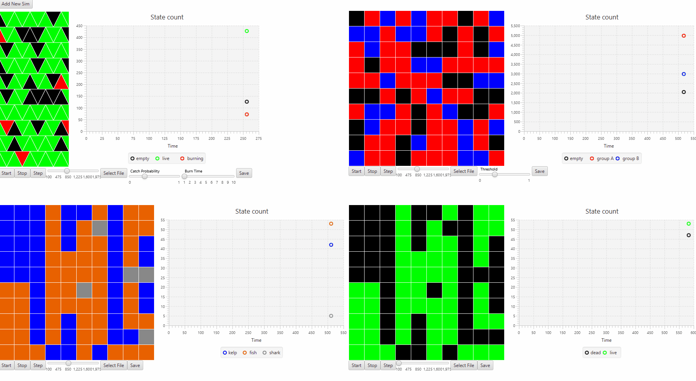

# Description
Environment for grid-based cellular automata simulations. Allows users to generate custom grid-based simulations easily through XML configuration files. Sample simulations included are game of life, predator prey, segregation, percolation, fire, and rock paper scissors. Users can simulate multiple models at once and step through epochs in real time.

