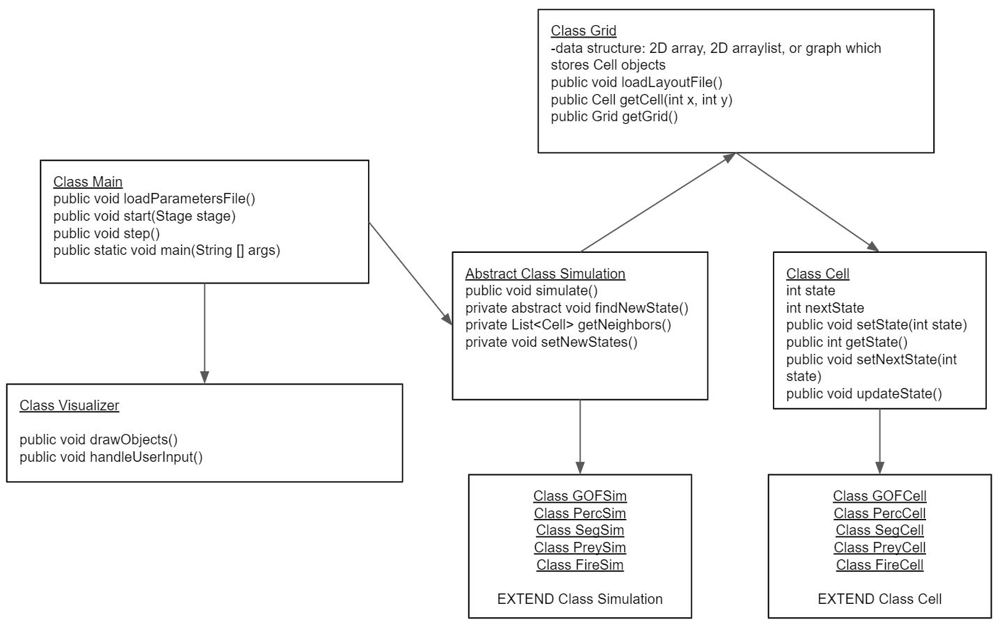
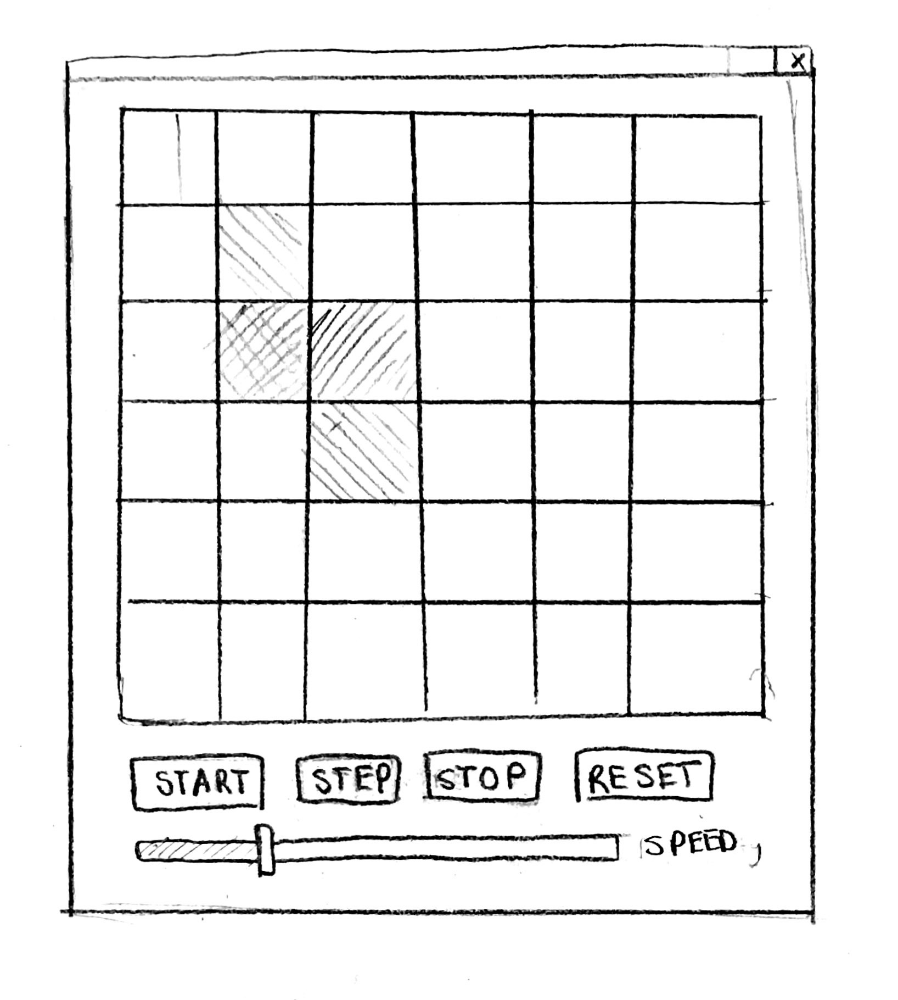

# Simulation Design Plan
### Team Number
### Names

## Introduction

## Overview

## User Interface

## Design Details

## Design Considerations

#### Components

#### Use Cases
* Within the Application class, there will be a call made to the step() function to advance the simulation by one epoch. Within step, the method called findNewState() will be called on the corresponding GOFSim simulation. Within the GOFSim object, the method will iterate through the nodes in the parameterized Grid object, eventually landing upon the middle cell. The GOFSim object will then call getNeighbors() on this Cell, finding that it has 4 direct neighbors. This will then trigger a simulation-specific game logic within the GOFSim class which calls the setState method on the Cell object, effectively setting the state to 0 (death). Since the Cell is an object, the change will carry over to the Cell in the Grid object. 
* Similarly to the 

## Team Responsibilities

 * Team Member #1
 * Team Member #2

 * Team Member #3

